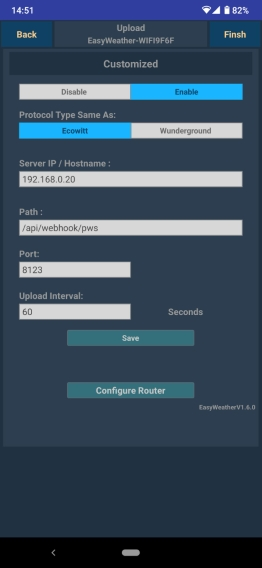
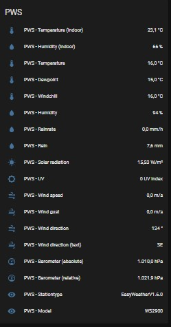
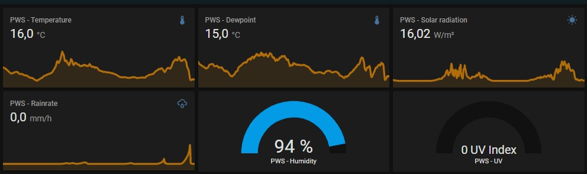

# PWS
This Domoticz Plugin allows you to get the data **directly** from your own personal weather station (PWS). So this plugin does **NOT** require that you register your PWS to cloud accounts, like WeatherUnderground (support will finish in the near future!), Ecowitt, WeatherCloud, WOW (takes weeks to get key), etc, or the use of WeeWX (extra software).

**This plugin will directly capture the data from your weather station!** 

## Supported devices
In general, if the station is supplied with `EasyWeather` software (version 1.4.x, 1.5.x), it is likely that the station will work with this HA Configuration!

## Prerequisites
Your PWS needs to be connected to your network. This can be done by using [WS View](#ws-view-ws-tool) app.

### WS View (WS Tool)
If supported by your PWS, connect your PWS with `WS View` (and also the 'older' `WS Tool`) to your router by wifi, so that your PWS can upload weather data to Domoticz.

1. Install `WS View` on your mobile device
    * [Google Play Store](https://play.google.com/store/apps/details?id=com.ost.wsview)
    * [Apple App Store](https://apps.apple.com/us/app/ws-view/id1362944193)
1. , or `WS Tool`
    * [Google Play Store](https://play.google.com/store/apps/details?id=com.dtston.wstool)
    * [Apple App Store](https://apps.apple.com/nl/app/ws-tool/id1125344077)
1. Follow the instructions to connect your PWS to your router
1. Goto to Device List in Menu and choose your PWS
1. Click on Next untill you are on on the `Customized` page
1. Choose `Enable`
1. For `Protocol Type Same As` choose `Ecowitt`
    * With Ecowitt the data will be send with a POST. Wunderground is using a GET, which is not (yet) supported by a HA webhook.
1. For `Server IP / Hostname` enter your HA Server ip address, eg. 192.168.0.10
2. For `Path` enter: `/api/webhook/pws`
3. `Port` enter a port number `8123`
4. `Upload Interval`, leave it `60` seconds
5. Click on `Save`



## Data
Example of data received from the PWS:

```
'PASSKEY': 'D7E76ED7E76D932CB06EC9A811179BA6', 'stationtype': 'EasyWeatherV1.6.0', 'dateutc': '2021-07-25+16:45:28'
, 'tempinf': '73.2', 'humidityin': '66', 'baromrelin': '30.160'
, 'baromabsin': '29.808', 'tempf': '66.2', 'humidity': '90'
, 'winddir': '200', 'windspeedmph': '0.9', 'windgustmph': '1.1'
, 'maxdailygust': '5.8', 'rainratein': '0.000', 'eventrainin': '0.051'
, 'hourlyrainin': '0.051', 'dailyrainin': '0.051', 'weeklyrainin': '0.051'
, 'monthlyrainin': '0.591', 'totalrainin': '88.248', 'solarradiation': '57.62'
, 'uv': '0', 'model': 'WS2900'
```

## Configuration
Use the [configuration.yaml](configuration.yaml) to setup the PWS entities.

Use the [customize.yaml](customize.yaml) to get appropriate icons for the entities

## Screenshots


