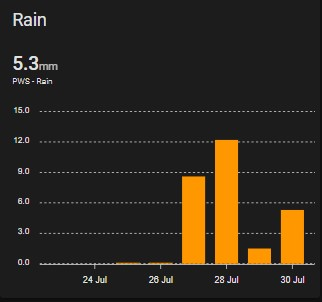

# Rain per day
To display the amount of rain per day, you can use:

## Configuration
```yaml
type: custom:apexcharts-card
graph_span: 8d
span:
  start: day
  offset: '-7d'
header:
  show: true
  title: Rain
  show_states: true
  colorize_states: true
series:
  - entity: sensor.pws_rain
    type: column
    group_by:
      func: max
      duration: 24h
```

## Screenshot

